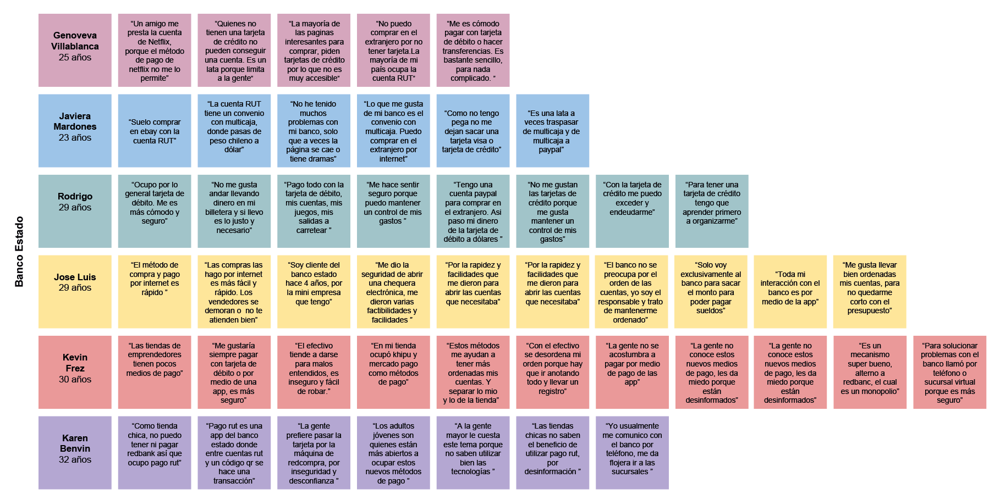
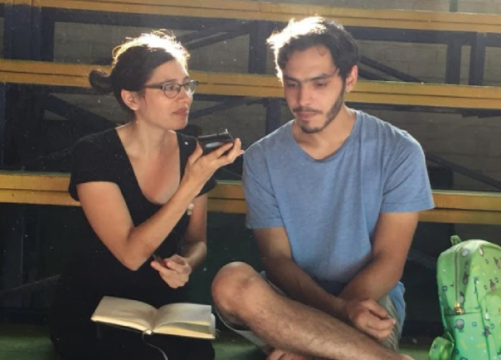
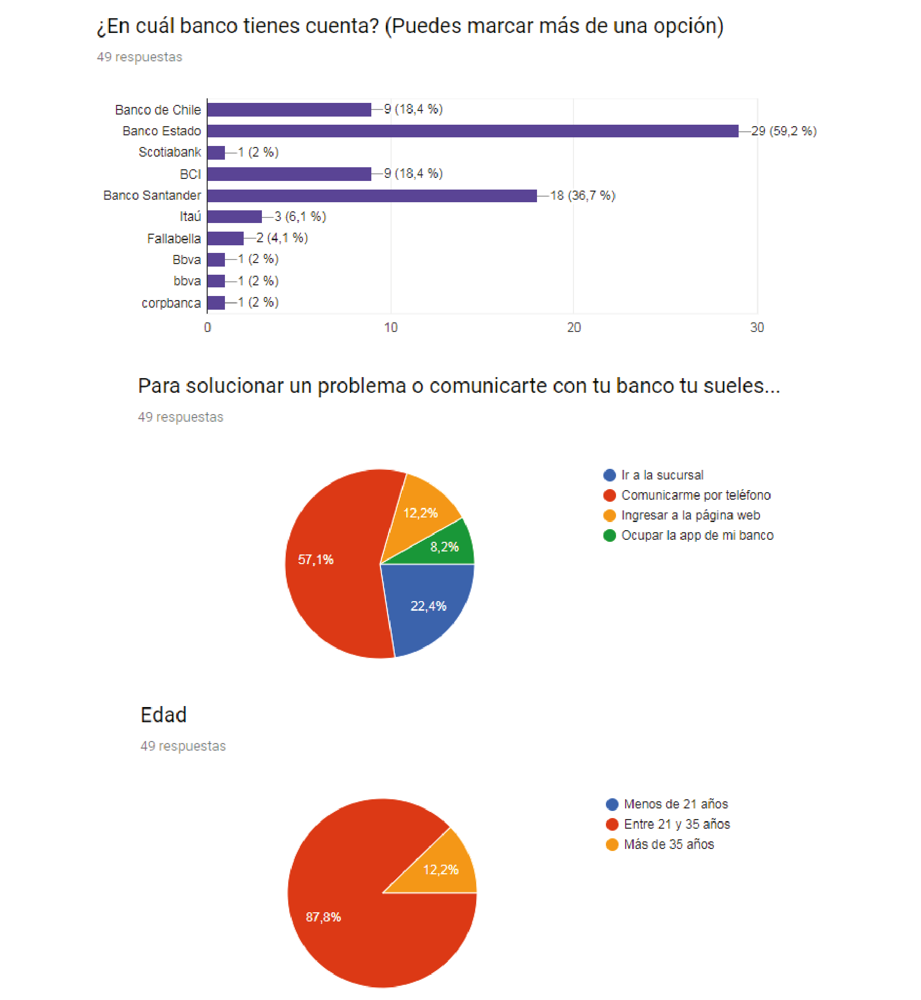
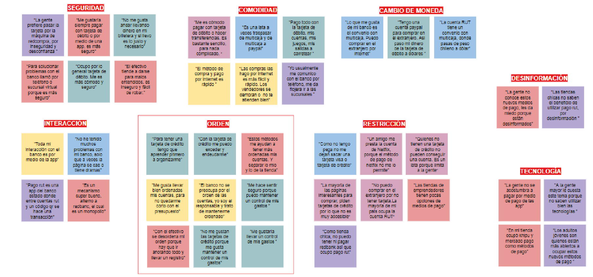
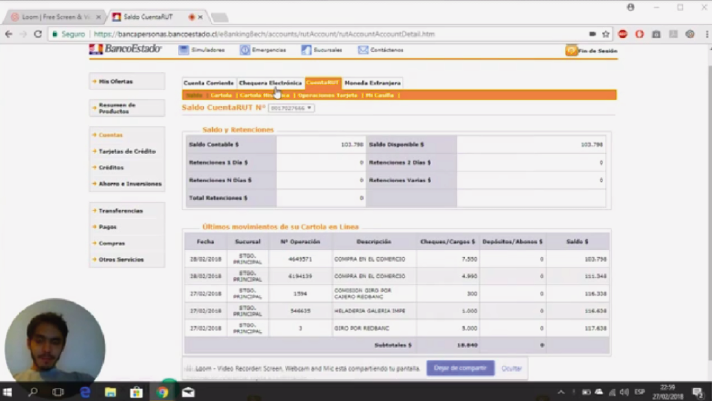
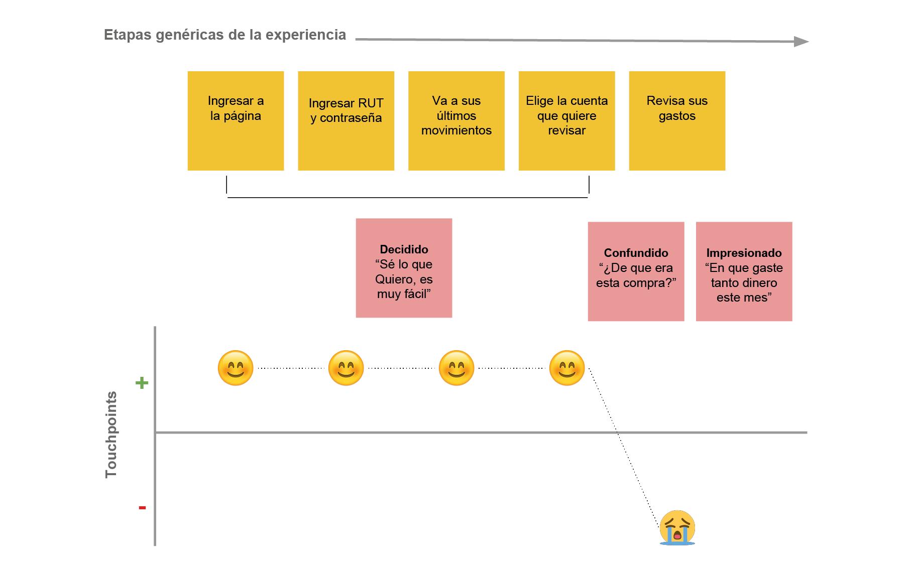
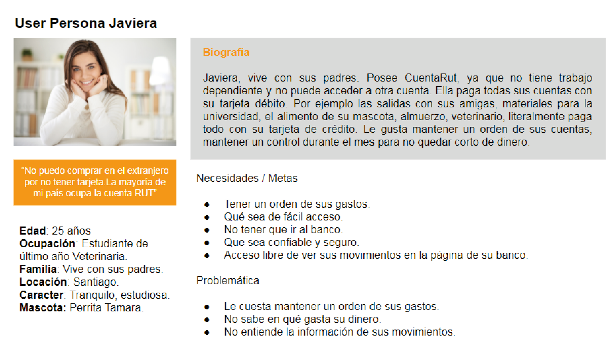
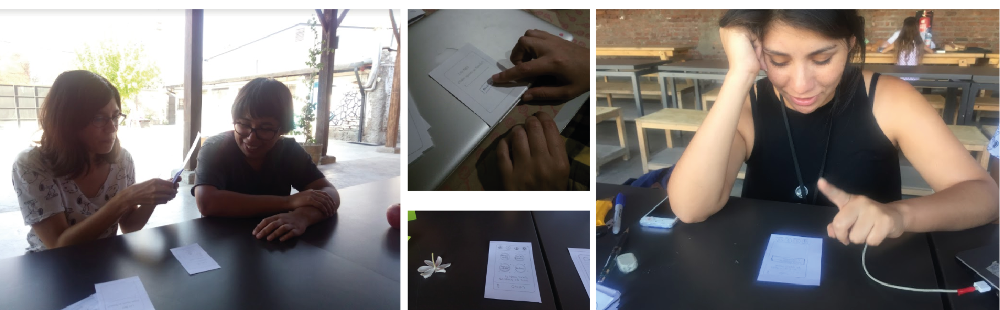
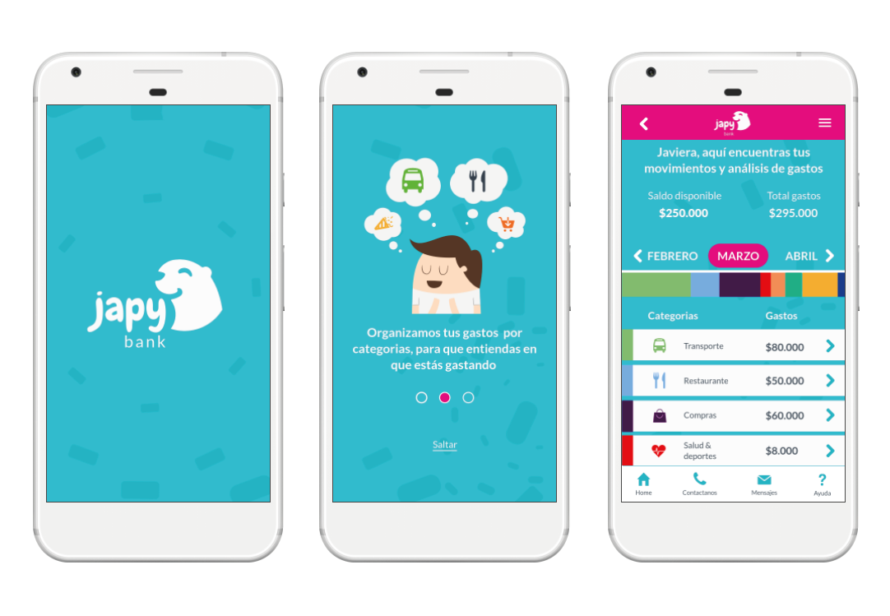

# Japy Bank

Japy Bank es un Banco digital Chileno enfocado en los millennials, ofreciendo como valor agregado, que puedan organizar sus gastos en categorías, para que entiendan en qué gastan su dinero.

## Desarrollado para

[Banco del País & Laboratoria](https://marvelapp.com/4h01f53/screen/39117965)
## Proceso de diseño

***
## Objetivo

El Banco del País es uno de los bancos más importante del país. Es una institución de muchos años y actualmente está pasando por un proceso de transformación digital. Como parte de este proceso, han implementado un área de innovación que quiere llegar de una mejor manera a los usuarios más jóvenes. Por lo que, inspirados en **Nequi, Nubank y Simplese** han propuesto crear un banco 100% digital dirigido para millenials.

### Objetivos
* Identificar quiénes son los stakeholders
* Planear una reunión de kick - off
* Generar un Business Model Canvas del nuevo banco digital
* Llevar a cabo las actividades de investigación
* Crear un prototipo de la nueva banca digital (crear el flujo de una función de la aplicación)
* Hacer sesiones de testing
* Iterar y concluir

## Mi rol dentro del proyecto

El proyecto se realizó en colaboración junto con Pabla Bazán. Ambas participamos en el proceso de diseño. Descubrimiento e investigación: Guión de entrevista, encuesta online y testing vídeo de la experiencia al momento de buscar información movimientos de una tarjeta. Proseguimos en el proceso de Síntesis y definición del proyecto, utilizamos las siguientes herramientas: diagrama de afinidad, customer journey, user persona. Continuamos con el proceso de ideación y prototipado realizamos wireframe y prototipo de alta fidelidad, para finalmente testear el prototipo con usuarios realeas con el fin de iterar y concluir.

#Descubrimiento e investigación
###Research Cualitativo

### Descubrimiento e investigación
***

Guión de entrevista objetivos de las preguntas son:
- ¿Qué representa el banco en la vida de los millennials?.
- ¿Qué tan informados están los millennials respecto a su banco?.
- ¿Cuáles son las necesidades bancarias de los millennials?.
- ¿Cómo interactúan los millennials con el banco?
- Conocer experiencias de los millennials al momento de realizar un trámite bancario.
- ¿Qué piensan los millennials sobre los bancos?.

Observamos, el tema de la seguridad se sienten más seguros al cancelar con sus tarjetas que con efectivo. Comodidad, prefieren transferir a través de banca en línea ya que no deben ir al banco. Restricción de pagos, por ejemplo solo con visa se puede contratar los servicios y la mayoría posee tarjetas de débito. 

### Encuesta 
***
**Resumen 41 respuestas**

- El 62.5% de las personas encuestadas es cliente del banco Estado, seguido por un 35% que pertenece al banco Santander y un 17,5% al Banco de Chile.

- El 87.5% pertenece a la generación de los millennials.

- El 60% de los encuestados no ha ido ninguna vez al banco dentro de estos 3 meses y el 37,5% ha ido entre 1 a 5 veces.

- El 40% ha ido al banco para cambiar su tarjeta, el 17,5% para sacar o ingresar dinero y el 12.5% para realizar una transferencia.

- Para solucionar un problema o comunicarse con su banco el 87.8% prefiere comunicarse por teléfono.

- El 24,4% quisiera tener tarjeta de crédito.
Pero no tienen porque: No quieren pagar su mantenimiento.
Por que piden una renta mensual, cosa que no tienen.
Por que no cuentan con sueldo fijo.
Falta de trabajo.
No poseen los requisitos necesarios que piden un banco.
No cumplen con los requisitos por ser estudiante y no tener ingresos.

- La mayoría de los encuestados con la tarjeta de débito suelen pagar en restaurantes, multitiendas, compras en internet (nacional) y pago de servicios básicos.

- La mayoría de los encuestados con la tarjeta de crédito suelen pagar sus compras por internet (extranjero), pagar netflix, multi tiendas y restaurantes pero el 43,9% no tiene tarjeta de crédito.

- A las personas les gustaría hacer los siguientes trámites de forma online: revisar su situación financiera para optar a más créditos u otros beneficios, activar, desbloquear o cambiar tarjetas, entrega de documentos que podrían enviarse por escáner, solicitar la renovación de los documentos en caso de pérdida, poder actualizar la libreta de ahorro.

## Síntesis y definición

Diagrama de afinidad, ordenamos por categorías las respuestas de las entrevistas para sintetizar y analizarlas. 

Gracias al diagrama de afinidad, nos enfocamos en uno de las categorías sobre el orden, ya que a los usuarios les cuesta mantener un orden y control de sus cuentas. 

Realizamos un testing de vídeo, a dos usuarios les pedimos de tarea que vieran su último movimiento y que nos informaran sobre que era. 

Observamos a los usuarios no supieron responder de inmediato en que habían utilizados sus últimos movimientos y que sería de gran ayuda poder ordenar esta información para tener un control y orden de sus cuentas. Realizamos un Customer Journey map para conocer los puntos críticos del testeo.

### User Persona
***

### Problem Statement

- Javiera necesita mantener un orden de sus gastos para entender en qué gasta su dinero.

### How Might We? | ¿Cómo podríamos?

- ¿Cómo podríamos hacer que Javiera sienta que tiene un control de sus gatos?

- ¿Cómo podríamos hacer que Javiera pueda recordar los movimientos que ha hecho con su tarjeta bancaria?

- ¿Cómo podríamos hacer que Javiera se informe de cuáles son sus mayores gastos mensualmente?

### What if… | Qué pasaría si…

- ¿Qué pasaría si existiese un registro visual exacto de los consumos de Javiera?

- ¿Qué pasaría si categorizamos cada uno de los gastos que realiza Javiera con su tarjeta?

- ¿Qué pasaría si organizamos sus gastos por colores?

Realizamos un wireframe en papel y lo testeamos a base sobre eso realizamos los cambios para el prototipo de alta fidelidad.

### Prototipo
***
En el prototipo se refleja nuestra conclusión. Cambiamos la visual de cómo entender de mejor manera en que están gastando los usuarios, reflejado en la información que se entrega en los movimientos de su tarjeta.

### Colaborador 
[Pabla Bazán](https://www.linkedin.com/in/pablabazan/)

 
